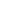

## Resume

- [Microsoft Word Document](https://yvesgurcan.com/resume.docx)
- [PDF](https://yvesgurcan.com/resume.pdf)
- [HTML](https://stackoverflow.com/cv/yvesgurcan)

## Online presence

- [ LinkedIn](https://linkedin.com/in/yvesgurcan)
- [ GitHub](https://github.com/yvesgurcan) / [ GitLab](https://gitlab.com/yvesgurcan)
- [ Stack Overflow](https://stackoverflow.com/users/11439562/yves-gurcan)
- [ NPM](https://www.npmjs.com/~yvesgurcan)
- [ Twitter](https://twitter.com/yvesgurcan)
- [ Medium](https://medium.com/@yvesgurcan) / [ DEV](https://dev.to/yvesgurcan)
- [ Twitch](https://www.twitch.tv/yvesgurcan/videos) / [ YouTube](https://www.youtube.com/channel/UCmNgbt5GFQfdwPOKaJ-NHYw/videos)
- [🏠 Website](https://yvesgurcan.com/)

## Talks

-  February 18, 2020: [AWS CloudFormation: A Stack in the Sky](https://www.meetup.com/Portland-Serverless-Architecture-Meetup/events/268360327/) ([slides](https://slides.com/yvesgurcan/cloudformation#/))
-  November 1, 2019: [Web Worker Workshop](https://www.meetup.com/Elm-Eug/events/gnzgkryzpbcb/) ([instructions](https://workers.yvesgurcan.com/workshop/))
-  October 11, 2019: [Intro to Styled Components](https://www.meetup.com/Elm-Eug/events/qsrfjryznbpb/) ([demo](https://styled.yvesgurcan.com/))
-  June 27, 2019: [Service Workers: Go Offline or Go Home](https://www.meetup.com/eugenewebdevs/events/261941044/) ([slides](https://slides.com/yvesgurcan/sw#/))

## Mentor

-  November 8-10, 2019: [Eugene Food Startup Weekend](http://communities.techstars.com/usa/eugene/startup-weekend/14837)
-  October 21-25, 2019: [Women In Tech Week](https://redefiningwomenintech.com/event/women-in-tech-week-oct-21-25)
-  April 13, 2019: [Workshop: API Discovery, Development, and Distribution](https://www.meetup.com/eugenewebdevs/events/260157602/)

## Open source projects

- [🎹 Web MIDI Player](https://midi.yvesgurcan.com)
- [🕹️ JavaScript Games](https://games.yvesgurcan.com)

## Freelance

- [ Upwork](https://www.upwork.com/o/profiles/users/~01597447d3d6d1ea57/)

## Frequently asked questions

- **How do you say your name?**

It's spelled Yves but it's actually pronounced "Eve". Like Adam and Eve. Or Steve. I know it can be difficult to guess the pronounciation, so don't worry too much about it. And if you're wondering, Yves is a French name. 🇫🇷 

- **Can you send me your resume?**

[My resume is available for download in various formats](#resume) at the top of this page. Don't hesitate to [message me on LinkedIn](https://www.linkedin.com/in/yvesgurcan) if you are interested in particular skillsets. I would be happy to send you a resume that better demonstrates my most relevant experience to you.

- **How many years of experience do you have?**
- **How did you become a software engineer?**
- **What kind of role are you interested in?**
- **Would you consider contracting work?**
- **Are you willing to relocate?**
- **Are you open to work remotely?**
- **What's your strength?**
- **What's your weakness?**
- **Which project you worked on is your favorite?**
- **Which project you worked on is your least favorite?**
- **How do you approach a problem?**
- **Back-end or front-end?**
- **Are you familiar with version control?**
- **Have you worked in Agile environments?**
- **What's your experience with test frameworks?**
- **Which design patterns are you familiar with?**
- **Are you familiar with the software development life cycle?**
- **What's the last technology you experimented with?**
- **Have you worked with graphic designers before?**
- **What's your salary expectation?**
